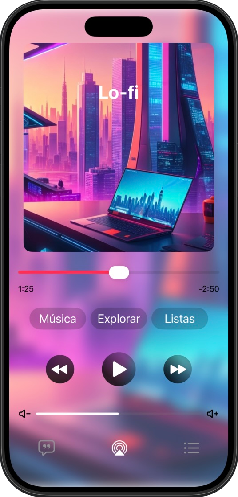

# Ejercicio 01 del SDP 25/26

## Descripción

Esta interfaz recrea una pantalla de música con diseño adaptado a iOS 26 usando Swift 6 y SwiftUI.  
Incluye una imagen de fondo en la parte superior, un icono de música centrado sobre el área de la dynamic island, una barra de reproducción y tres botones circulares con sus respectivas etiquetas.

## Objetivos del ejercicio

- Practicar el uso de imágenes como cabecera con `resizable()` y `scaledToFill()`.
- Colocar contenido sobre zonas de notch usando `safeAreaInset` y capas (`ZStack`).
- Implementar una barra de reproducción con controles básicos.
- Crear botones circulares con etiquetas inferiores.
- Seguir patrones de diseño de iOS 26 (Liquid Glass, jerarquía visual clara, márgenes amplios).

## Capturas de pantalla

## Tecnologías utilizadas

- **Swift 6**
- **SwiftUI**
- **Xcode 26**
- Diseño siguiendo patrones de **Liquid Glass** introducidos en iOS 26.

## Ejecución

1. Clona o descarga el repositorio a tu equipo.
2. Abrir el proyecto con Xcode 26 o superior.
3. Seleccionar un dispositivo iOS 18 o superior.
4. Ejecutar con `⌘R`.

## Licencia

Proyecto creado con fines educativos.
